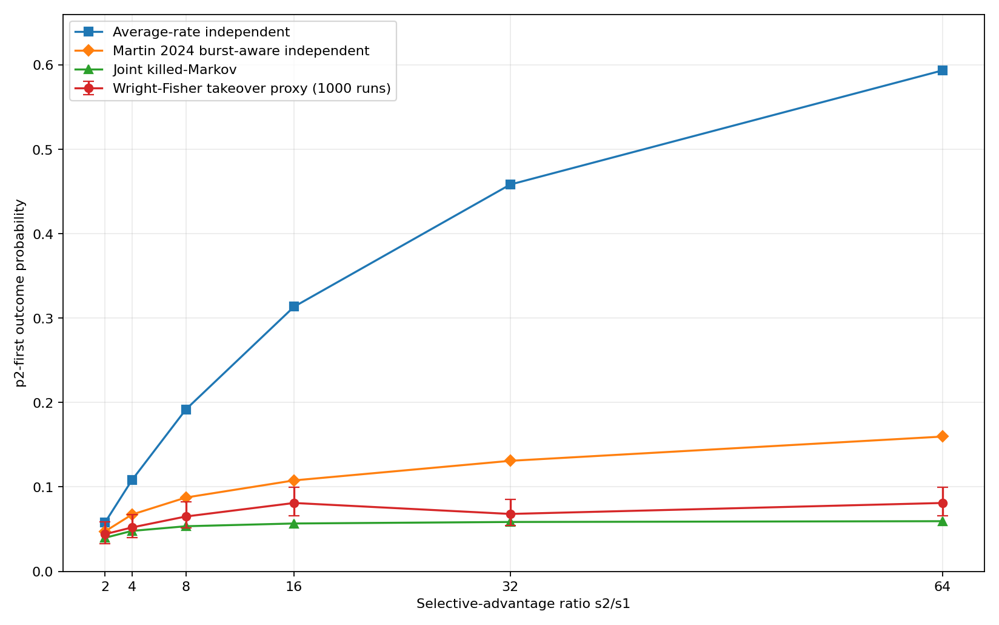

# Joint Portal Dynamics on an RNA Neutral Network Improve Prediction of Competing Adaptive Fixations

Computational preprint repository for a state-resolved model of competition between adaptive phenotype portals on a shared neutral network.

## Main result

In the focal two-peak RNA system of Martin et al. (2024), direct Wright-Fisher re-execution used **N=500**, per-site **mu=2e-5**, **s1=0.005**, six values of **s2**, and **1,000 replicates per condition**.

| Model | MAE vs Wright-Fisher takeover proxy | Conditions with lower error than joint |
|---|---:|---:|
| Average-rate independent | 0.22200 | 0/6 |
| Martin et al. burst-aware independent | 0.03489 | 1/6 |
| Joint killed-Markov | **0.01256** | - |

The joint model reduces MAE by **64.0% relative to the stronger burst-aware independent baseline** and by **94.3% relative to the simple average-rate baseline**. It is closer than the burst-aware model in **5/6** conditions and closer than the average-rate model in **6/6**.



## What is and is not claimed

This repository **does not claim new Markov-chain mathematics**. Absorbing/killed Markov processes and first-passage methods are established. It also does not claim discovery of portal-limited or bursty phenotype arrival; those are prior results.

A close methodological precedent is Rozhoňová et al. (2024), who used standard Markov-chain theory on empirical adaptive landscapes and partitioned absorbing transitions into B1/B2 classes to calculate the probability of entering a target genotype set through specified transition classes (PLoS Biology 22:e3002594; DOI 10.1371/journal.pbio.3002594). Therefore **genotype-level partitioned absorbing-state calculations are not claimed as new**.

The narrow contribution tested here is whether competing adaptive portal sets are better represented as **one state-resolved process on the shared neutral network**, rather than by factorizing the competing phenotype outcomes after separately estimating their marginal arrival/fixation statistics. Martin et al. (2024) explicitly identified dependence between multiple phenotype-introduction processes as a limitation/future-work direction. The direct Wright-Fisher comparison uses the dominant adaptive phenotype when resident p0 first falls below 25% as a takeover proxy for which adaptive phenotype fixes first.

The portal sets in this focal map have **zero genotype overlap**. “Joint” therefore refers to dependence through the **shared neutral trajectory**, not positive overlap or correlation of the portal sets themselves.

## Focal RNA system

- start sequence: `ACCUAAAAAAGG`
- resident p0: `19529749` / `.(((.....)))`
- p1: `27262981` / `((........))`
- p2: `27918661` / `((((...)).))`
- neutral component: 1,937 genotypes, 13,355 neutral edges
- p1 portal edges: 517
- p2 portal edges: 16
- portal-genotype overlap: 0

The reconstruction used ViennaRNA 2.7.2. Martin et al. used ViennaRNA 2.4.14. The focal start phenotype matches exactly and recovered portal frequencies closely match the published two-peak example, but exact version-matched reconstruction remains a submission-strengthening step.

## Repository layout

- `src/rna_gp.py` - RNA folding and focal neutral-component reconstruction
- `src/joint_portal_model.py` - average-rate, published burst-aware independent, and joint killed-Markov analytic predictions
- `src/wright_fisher_validation.py` - repository-native count-level Wright-Fisher validation runner
- `src/wright_fisher_validation_legacy_runner.py` - historical runner used for the frozen 1000x6 reference
- `src/summarize_results.py` - comparison summary
- `scripts/VERIFY_RELEASE_FROM_POWERSHELL.ps1` - release checksum/file integrity gate
- `results/reference/` - frozen reference results from the completed run
- `figures/` - manuscript figures
- `paper/` - public preprint v1.1 (DOCX + PDF), including the 25 August 2026 prior-art re-audit
- `docs/PRIOR_ART_AND_CLAIM_BOUNDARY.md` - novelty boundary
- `docs/THREE_PASS_PROOFREAD_REPORT.md` - corrections made before public release

## Quick analytic reproduction (Windows PowerShell)

```powershell
Set-ExecutionPolicy -Scope Process Bypass -Force
.\scripts\RUN_ANALYTIC_FROM_POWERSHELL.ps1
```

For a quick end-to-end smoke test, run `scripts/RUN_QUICK_CHECK_FROM_POWERSHELL.ps1`. For the full 1000x6 rerun, use `scripts/RUN_FULL_FROM_POWERSHELL.ps1`; it is computationally heavy and resumes only completed coarse stages (not individual replicates). See `REPRODUCE.md`.

## Reference result

Frozen reference result: `results/reference/final_summary.json`.

## License

Repository-authored software is released under the MIT License. The manuscript is released under CC BY 4.0. Third-party dependencies remain under their own licenses; see `THIRD_PARTY.md`.

## Citation

Public author: **Ryutaro Yonezu**. Archived software release `v1.1.0`: DOI **10.5281/zenodo.22095082** (https://doi.org/10.5281/zenodo.22095082). Machine-readable citation metadata are provided in `CITATION.cff`.
